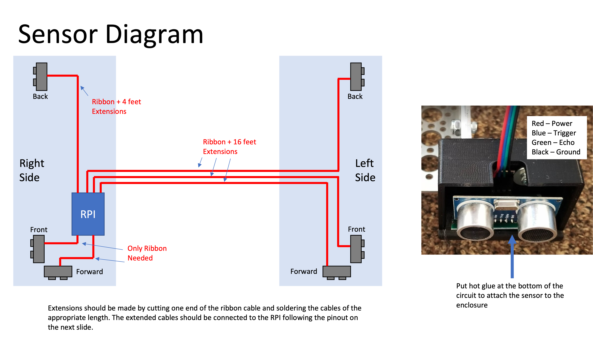
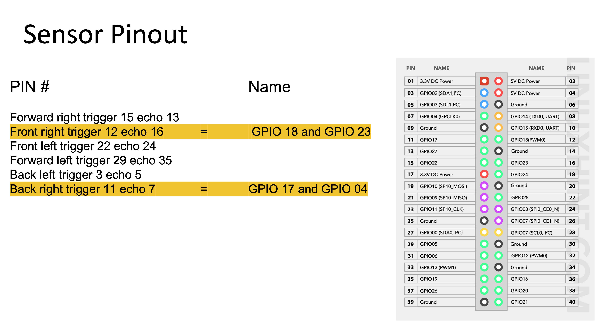

# TAMU-BenchBot
Everything related the PSA BenchBot at Texas A&amp;M University at College Station, TX

#### Table of Contents
[Sensor layout](#sensor-layout)

---

 

## Ultrasonic Sensors

### Sensor layout

**NOTE:** V1 BenchBot only uses 2 ultrasonic sensors, front right and back right.

### Pin layout

